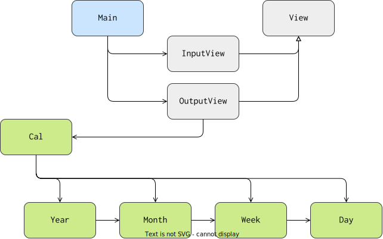

# Architecture

This project used the MVC(Model - View - Controller) architecture, and it's components are visually displayed on the picture below

🟩 - are the Model component(s)
⬜️ - are the View component(s)
🟦 - are the Controller component(s)

The graph also shows the relations of the classes.
